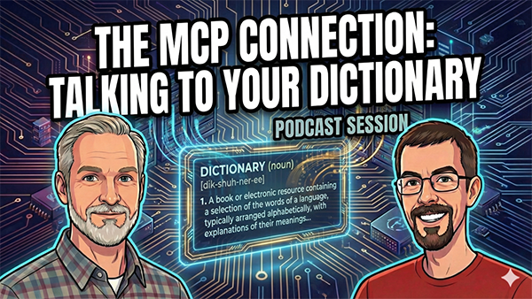
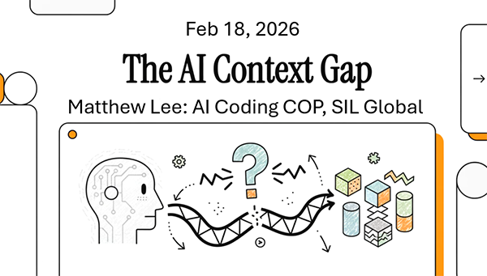

# FLExTools MCP

An MCP server that enables AI assistants to write FLExTools scripts and directly manipulate FieldWorks lexicon data using natural language.

Developed for SIL Global by Matthew Lee in connection with the SIL's AI Integration Advisory Board and the FLExTrans team.

## Quick Overview

**What it does:** FLExTools MCP gives AI assistants (Claude, Copilot, Gemini) the knowledge to write FLExTools modules by providing indexed, searchable documentation of LibLCM and FlexLibs APIs.

** Videos **

## Videos

**[The MCP Connection: Talking to your Dictinary](https://vimeo.com/showcase/12149678?video=1171396540)**

This podcast, for a linguistic audience, gives an overview of using the FLExTools MCP.

[](https://vimeo.com/showcase/12149678?video=1171396540)

**[MCPs for FLEx and FLExTools: LangTech AI Software Engineering CoP](https://www.youtube.com/watch?v=JyNwUbAWYIM)**

This presentation, given to an audience of programmers, discusses the background, architecture, and advantages of an MCP, and introduces the FLExTools MCP.

[](https://www.youtube.com/watch?v=JyNwUbAWYIM)

**Three ways to use it:**
1. Generate legacy modules (FlexLibs stable)
2. Generate modern modules (Flexicon with ~1,400 functions)
3. Run operations directly on FieldWorks databases using natural language queries

**Example:** "Delete any sense with 'q' in the gloss" → AI generates, tests, and runs the operation automatically.

⚠️ **Warning:** Backup your project first - there are no guard-rails.

## Why MCP? Why AI?

- **What is an MCP Server?** See [WHY-MCP.md](docs/WHY-MCP.md) - explains the LibLCM complexity problem and why generic AI assistants fail
- **When is AI useful?** See [WHY-AI.md](docs/WHY-AI.md) - learning curve problems and when manual approaches are better

## Getting Started

### 1. Installation

FLExToolsMCP is published on PyPI. The indexed API documentation ships inside
the package, so there is nothing to clone or build. The one prerequisite is
FieldWorks/FLExTools, which means **Windows + .NET**.

**One-line install (recommended)** — no repo, no manual dependency install:

```bash
# Claude Code
claude mcp add flextoolsmcp -- uvx flextoolsmcp
```

`uvx` (from [uv](https://docs.astral.sh/uv/)) fetches the package and all of its
dependencies — including [Flexicon](https://pypi.org/project/pyflexicon/), the
deep FieldWorks wrapper — into an isolated cache and runs the server. Nothing
else to install. Upgrading FLExToolsMCP re-resolves to the latest compatible
Flexicon. Prefer a persistent install? `uv tool install flextoolsmcp` or
`pip install flextoolsmcp`.

**Manual MCP config** (Claude Desktop, Cursor, and other tools):

```json
{
  "mcpServers": {
    "flextoolsmcp": {
      "command": "uvx",
      "args": ["flextoolsmcp"]
    }
  }
}
```

### 2. Connect to Your AI Assistant
See [SETUP.md](SETUP.md#connecting-to-ai-assistants) for Claude Code, Antigravity, and other tools.

**Note:** Each AI tool has different MCP configuration syntax. See SETUP.md for your specific tool.

**User data** lives under `~/.flextoolsmcp/` (logs, saved skeletons, cached
models, and any runtime-refreshed indexes) — it persists across upgrades.

### Developing from source
```bash
git clone https://github.com/MattGyverLee/FlexToolsMCP.git
cd FlexToolsMCP
pip install -e ".[dev]"     # editable install with dev tools (pulls in Flexicon)

# Test it works
python -c "from flextoolsmcp.server import APIIndex, get_index_dir; i=APIIndex.load(get_index_dir()); print('Loaded', len(i.flexicon.get('entities', {})), 'Flexicon entities')"
```

### 3. Updating to New Versions
`uvx flextools-mcp` picks up new releases automatically (force with
`uvx flextools-mcp@latest`); for a persistent install run
`uv tool upgrade flextools-mcp` or `pip install -U flextools-mcp`. See
[SETUP.md](SETUP.md#updating) for details.

### 4. Start Using
See [USAGE.md](USAGE.md) for workflows, tool reference, and examples.

## What's Included

### MCP Tools (16)

**Admin & Config:**
- `flextools_start` - Initialize session, set project and API mode
- `flextools_manage_config` - Get/set/delete persistent configuration
- `flextools_get_session_history` - View operation history and undo stack
- `flextools_undo_last_operation` - Undo the most recent write
- `flextools_get_module_template` - Get FLExTools module boilerplate

**Discovery:**
- `flextools_search_by_capability` - Find APIs by natural language intent
- `flextools_get_object_api` - Get full API for an object/operations class
- `flextools_get_navigation_path` - Find traversal between object types
- `flextools_find_examples` - Get code examples by operation type
- `flextools_resolve_property` - Check casting requirements for properties

**Catalog:**
- `flextools_list_categories` - List semantic domains (lexicon, grammar, etc.)
- `flextools_list_entities_in_category` - List entities in a domain

**Module & Execution:**
- `flextools_start_module` - Interactive wizard for new module
- `flextools_get_operation_logs` - View logs and pattern recommendations
- `flextools_run_module` - Execute code with dry-run and write modes

### API Coverage
- **LibLCM**: 2,295 C# entities
- **FlexLibs Stable**: ~71 methods
- **Flexicon**: ~1,400 methods (99% documented, 82% with examples)

### Test-Proven Examples
```
"Remove 'el ' from the beginning of any Spanish gloss"
"Add an environment named 'pre-y' with the context '/_y'"
"Delete the entry with lexeme ɛʃːɛr"
"List entries with "ː" in the headword"
"Are there any duplicates by gloss (fuzzy match) and POS?"
```

## Key Features

- **Discovery-first workflow** - the AI assembles modules from indexed building blocks (signatures, navigation skeletons, examples, casting fixes) rather than inventing API calls from training memory. See [USAGE.md](USAGE.md#recommended-workflow).
- **Automatic index refresh** when you update FieldWorks or libraries
- **Dry-run mode** to test before writing data
- **Semantic search** with synonym expansion
- **Pythonnet casting detection** - warns when you need type conversions
- **Code examples** extracted from real-world usage
- **Multiple library versions** supported simultaneously

## Documentation

| Document | Purpose |
|----------|---------|
| [HISTORY.md](HISTORY.md) | Release notes and version history |
| [SETUP.md](SETUP.md) | Installation and AI tool configuration |
| [USAGE.md](USAGE.md) | How to use the MCP, workflows, examples |
| [DEVELOPMENT.md](DEVELOPMENT.md) | Project structure, architecture, contributing |
| [docs/WHY-MCP.md](docs/WHY-MCP.md) | Why FieldWorks needs MCP servers |
| [docs/WHY-AI.md](docs/WHY-AI.md) | When AI is useful for FieldWorks work |
| [docs/INNOVATIONS.md](docs/INNOVATIONS.md) | Technical innovations in this MCP |
| [docs/BACKGROUND.md](docs/BACKGROUND.md) | Project history |

## Safety & Limitations

### Safety
- **Always backup before write operations** - the MCP defaults to dry-run mode
- Dry run shows what would happen before writing
- Requires explicit user permission for write operations

### Limitations
- Cannot control the FLEx GUI (filters, display, etc.)
- Only manipulates data, not UI state
- Flexicon still undergoing extensive testing
- Some Scripture module edge cases recently fixed

## Architecture

```
User Request -> AI Assistant -> MCP Server -> Indexed APIs
                    |
            Generated FLExTools Script or Direct Execution
                    |
            FLExTools (IronPython) or Flexicon
                    |
            LibLCM (C# data model)
                    |
            FieldWorks Database
```

For technical details, see [DEVELOPMENT.md](DEVELOPMENT.md#architecture).

## License

MIT License - See LICENSE file for details

## Contributing

Contributions are welcome! Please submit issues and pull requests on GitHub.

For development info, see [DEVELOPMENT.md](DEVELOPMENT.md).

## Acknowledgments

- The FieldWorks developers (Jason, Ken, Hasso, and team)
- Craig, the developer of FLExTools and FlexLibs
- The SIL AI Implementation Advisory Board
- Ron, Beth and the FLExTrans team
- My mentors Doug, Jeff, and Jenni at SIL LangTech
