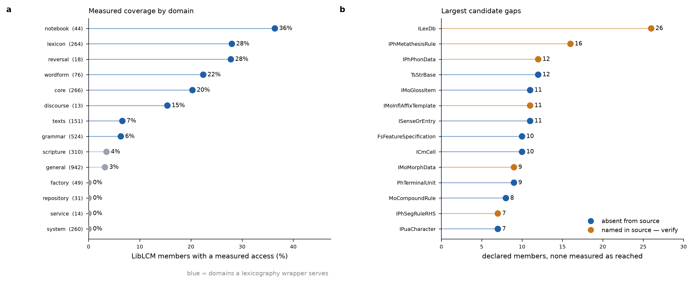

<!-- Generated analysis. Do not hand-edit: regenerate instead (see Provenance). -->

# flexicon → LibLCM coverage

Measured from the indexes on `fix/member-level-coverage` @ `2a9d1de`: LibLCM v11 (2,026 types) against flexicon v4.12.0 (125 classes, 1,660 methods). No FieldWorks installation or live project is involved — every figure here is derived from the pre-computed index files, which is also the point: they are what the MCP server tells a model is true.

## How coverage is measured

A member counts as covered when the analyzer resolves the LCM **type** of a receiver and the index confirms that type declares the member — recorded qualified, as `ILexSense.Gloss`, and attributed to the type that *declares* the member rather than the subtype the call went through. Receiver types come from five routes: a parameter annotation; the `Args:` block of the docstring; a relationship traversal (`for s in entry.SensesOS` → `ILexSense`); a factory or repository call; and `getattr(obj, "Member")`.

This replaces counting which LCM types flexicon *names*. Naming is a poor proxy: a type obtained from a factory, a traversal or a parameter is never named, so `MoAffixForm` and `IMoInflAffixTemplate` both looked unreachable while being fully wrapped.

### What measurement still cannot see

Receivers of the form `self.<attr>` are not typed, and that is where the remaining misses concentrate. flexicon uses `self.<private attr>.<Member>` 67 times across four attributes (`_concrete` 31, `_obj` 29, `_inner` 5, `_helper` 2). Two consequences are visible in the results below:

- `ILexDb` (26 members) is read throughout `LexEntryOperations` as `self.project.lp.LexDbOA.MorphTypesOA`, `.Entries`, `.ComplexEntryTypesOA`. The chain root `self.project` is untyped, so none of it resolves and `ILexDb` scores zero.
- `IPhMetathesisRule` (16 members) is read as `self._concrete.StrucDescOS`, where `_concrete` is union-typed (`IPhRegularRule | IPhMetathesisRule`) and discriminated at runtime by `if self.class_type != "PhMetathesisRule"`.

**Every number here is therefore a floor on coverage and a ceiling on the gap.**

## Results

- **252 of 2,971 members** of public LCM interfaces and abstract classes carry a measured access — **8.5%**.
- Those sit in **71 types** whose combined surface is 882 members; within the types flexicon demonstrably works with, coverage is **28.6%**.
- The other **917 public types** show no measured access at all.

### By domain

`served` marks the domains a lexicography wrapper is expected to cover; the rest (the data-access layer, scripture, infrastructure) are out of scope by design, not overlooked.

| domain | served | types | members | reached | unreached | % |
|---|:--:|---:|---:|---:|---:|---:|
| general | — | 168 | 942 | 30 | 912 | 3.2 |
| grammar | yes | 342 | 524 | 33 | 491 | 6.3 |
| scripture | — | 75 | 310 | 11 | 299 | 3.5 |
| system | — | 57 | 260 | 0 | 260 | 0.0 |
| core | yes | 35 | 266 | 54 | 212 | 20.3 |
| lexicon | yes | 60 | 264 | 74 | 190 | 28.0 |
| texts | yes | 57 | 151 | 10 | 141 | 6.6 |
| wordform | yes | 29 | 76 | 17 | 59 | 22.4 |
| factory | — | 59 | 49 | 0 | 49 | 0.0 |
| repository | — | 59 | 31 | 0 | 31 | 0.0 |
| notebook | yes | 12 | 44 | 16 | 28 | 36.4 |
| service | — | 13 | 14 | 0 | 14 | 0.0 |
| reversal | yes | 8 | 18 | 5 | 13 | 27.8 |
| discourse | yes | 12 | 13 | 2 | 11 | 15.4 |
| writing_system | — | 2 | 9 | 0 | 9 | 0.0 |

`general` carries the largest absolute shortfall in the model at 912 unreached members, but it holds the data-access layer (`ISilDataAccess`, `SilDataAccessManagedBase`, `DomainDataByFlidDecoratorBase`) that flexicon deliberately does not wrap. **Within the served domains the largest shortfall is grammar, at 491 unreached members** — ahead of core (212) and lexicon (190).

Coverage is highest in notebook (36.4%), reversal (27.8%) and lexicon (28.0%), but only lexicon has enough surface (264 members) for its percentage to be a stable signal; reversal's rests on 5 members of 18.

## Candidate gaps

**114 types carrying 415 members** qualify: in a served domain, declaring members, not a `*Tags` constant holder, not reachable by inheritance, and with zero measured coverage. They split by whether flexicon's source mentions the type at all:

- **89 absent from the source entirely** — genuine gaps.
- **25 named in the source** — almost certainly coverage the detector cannot see (the `self.<attr>` blind spot). Verify before treating any of these as work.

### Genuine gaps, by domain

**Grammar — morphology and phonology rules** — 44 types, 128 members
`IMoGlossItem` (11); `FsFeatureSpecification` (10); `PhTerminalUnit` (9); `MoCompoundRule` (8); `PhPhonContext` (6); `FsAbstractStructure` (5); `IMoStratumApp` (5); `PhContextOrVar` (5); `IMoCompoundRule` (5); `IMoReferralRule` (4); `IPhPhonemeSet` (4); `IMoDeriv` (4); `MoDerivTrace` (4); `PhSimpleContext` (4); `MoRuleMapping` (3); `IMoDerivAffApp` (3); `IMoInflAffixSlotApp` (3); `IMoBinaryCompoundRule` (3); `IMoCompoundRuleApp` (3); `IMoModifyFromInput` (2); `IMoPhonolRuleApp` (2); `IMoInflTemplateApp` (2); `IMoMorphTypeFactory` (2); `IFsNegatedValue` (1); `IFsDisjunctiveValue` (1); `IFsFeatStrucDisj` (1); `IFsOpenValue` (1); `IFsSharedValue` (1); `IMoCopyFromInput` (1); `IMoMorphTypeRepository` (1); `IMoModifyFromInputRepository` (1); `IMoMorphDataRepository` (1); `IMoGlossSystem` (1); `IMoDerivTrace` (1); `IMoInsertNC` (1); `IMoInsertPhones` (1); `IPhSimpleContextNCRepository` (1); `IPhSequenceContextRepository` (1); `IPhPhonRuleFeat` (1); `IPhPhonDataRepository` (1); `IPhEnvironmentRepository` (1); `IPhIterationContextRepository` (1); `IPhBdryMarkerFactory` (1); `IPhSimpleContextSegRepository` (1)

**Texts** — 25 types, 86 members
`TsStrBase` (12); `IPuaCharacter` (7); `IStFootnote` (6); `TsPropsBase` (6); `ITextTag` (6); `StPara` (6); `UCDCharacter` (6); `IUcdCharacter` (5); `IBidiCharacterFactory` (4); `IPuaCharacterFactory` (4); `IParagraphCounterRepository` (3); `IStructuredTextDataAccess` (3); `IStJournalText` (3); `IStyleProp` (2); `IStStyleFactory` (2); `INormalizationCharacterFactory` (2); `IParagraphCounter` (1); `IStFootnoteRepository` (1); `IStylesheet` (1); `IStTxtParaRepository` (1); `IStoresDataAccess` (1); `IStTextRepository` (1); `IStoresLcmCache` (1); `ITextTagRepository` (1); `ITextTagFactory` (1)

**Lexicon** — 7 types, 23 members
`ISenseOrEntry` (11); `ILexEntryRefRepository` (4); `ILexExtendedNote` (3); `IChkSense` (2); `ILexAppendix` (1); `ILexDbRepository` (1); `ILexReferenceRepository` (1)

**Core objects** — 7 types, 19 members
`ICmCell` (10); `ICmMedia` (2); `ICmObjectId` (2); `ICmResource` (2); `ICmIndirectAnnotation` (1); `ICmPossibilitySupplier` (1); `ICmRow` (1)

**Wordform inventory** — 3 types, 10 members
`IWordFormLookup` (5); `IWfiWordSet` (3); `IWordformLookupList` (2)

**Discourse** — 2 types, 2 members
`IDsChartRepository` (1); `IDsDiscourseDataRepository` (1)

**Research notebook** — 1 types, 1 members
`IRnResearchNbkRepository` (1)

### Named in the source — verify first

| type | domain | members | mentions |
|---|---|---:|---:|
| `ILexDb` | lexicon | 26 | 4 |
| `IPhMetathesisRule` | grammar | 16 | 37 |
| `IPhPhonData` | grammar | 12 | 3 |
| `IMoInflAffixTemplate` | grammar | 11 | 11 |
| `IMoMorphData` | grammar | 9 | 11 |
| `IPhSegRuleRHS` | grammar | 7 | 4 |
| `MoAffixForm` | grammar | 7 | 1 |
| `IMoStemName` | grammar | 6 | 5 |
| `IMoDerivStepMsa` | grammar | 5 | 6 |
| `MoAdhocProhib` | grammar | 5 | 1 |
| `IStyle` | texts | 5 | 2 |
| `IRnResearchNbk` | notebook | 5 | 4 |
| `IMoAffixProcess` | grammar | 4 | 1 |
| `ILexEntryInflType` | lexicon | 4 | 8 |
| `IMoAlloAdhocProhib` | grammar | 3 | 1 |
| `IMoMorphAdhocProhib` | grammar | 3 | 1 |
| `IMoAdhocProhibGr` | grammar | 3 | 17 |
| `IPhRegularRule` | grammar | 3 | 51 |
| `IPhIterationContext` | grammar | 3 | 8 |
| `IFsOpenFeature` | grammar | 2 | 2 |
| `IMoAdhocProhib` | grammar | 2 | 1 |
| `IMoEndoCompound` | grammar | 2 | 36 |
| `IMoExoCompound` | grammar | 1 | 32 |
| `IPhSimpleContextSeg` | grammar | 1 | 22 |
| `IPhSimpleContextBdry` | grammar | 1 | 17 |

## Reading this list

Unreferenced is not the same as needed-and-missing. Nothing here says a field linguist has ever reached for `IPhSegRuleRHS`. Priority comes from session logs — which gaps users actually hit — not from this inventory; see the `flexicon-gap-triage` skill for that half.

Raising measured coverage further is now largely a flexicon question rather than an indexing one: a method with a one-line docstring and no annotation leaves its receiver untyped, and about half of all methods currently seed no type environment.

## Provenance

Generated from the committed indexes, not from a live project. Regenerate with the
`flexicon-gap-triage` skill (`flexgap_audit(index_dir=...)`) or
`python src/build_reverse_mapping.py --update-liblcm` followed by a fresh run.

| input | sha256 (first 12) |
|---|---|
| `liblcm_api` | `efadf2ee38a0` |
| `flexicon_api` | `e139b0798945` |
| `flexicon_lcm_bridge` | `bf9723c35408` |
| `reverse_mapping` | `7e507ce6c681` |

Indexes last changed by `08e2062 2026-10-07`. If those hashes no longer match the files in
`src/flextoolsmcp/index/`, this document is stale — the numbers below describe a
different index than the one in the tree.
